# Overview
This is my repository for the second project of the Azure Machine Learning Engineer Nanodegree. 
 
The goal of this project is to train a machine learning model for production with automl, deploy it and consume it. 
This same process is also done via Azure Pipelines.  
# Youtube screencast
I have made a short video going through the below steps, so you can have an even better understanding of the complete workflow.
I hope it helps! 

# Architectural diagram
[!image](https://github.com/hualcosa/nd00333_AZMLND_C2/assets/46836901/6ddefd9d-69a9-44d5-9daa-efd719556ab5)

1. Authentication
  
 
  In this step, you will need to install the Azure Machine Learning Extension which allows you to interact with Azure Machine Learning
  Studio, part of the az command. After having the Azure machine Learning Extension, you will create a Service Principal account and
  associate it with your specific workspace.
   
 

 Service principal creation:  
 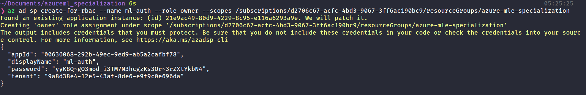
 I'm using azure cli V2. In this version, the "az ml workspace share" was replaced by the following one:  
 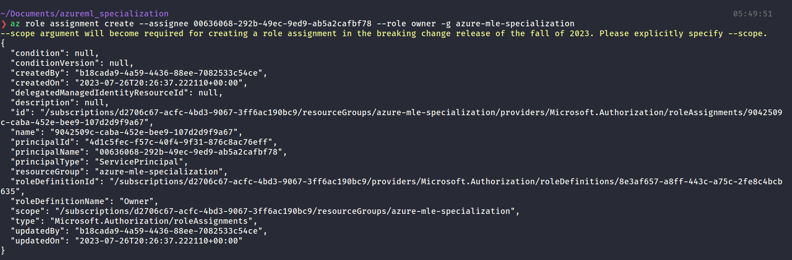
 
2. Automated ML Experiment
  
 
  In this step, you will create an experiment using Automated ML, configure a compute cluster, and use that cluster to run the experiment.
    
 

 
Registered dataset

 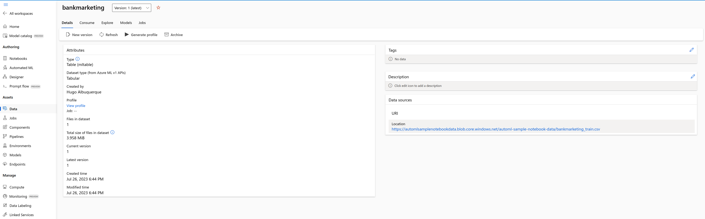
 
Automl experiment completed

 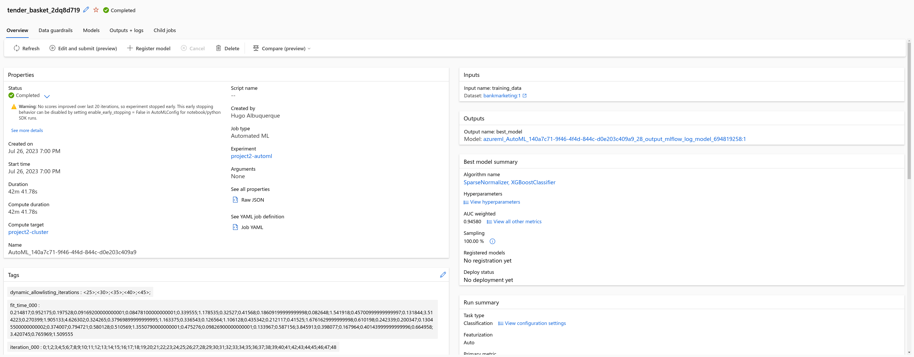
 
best model found

 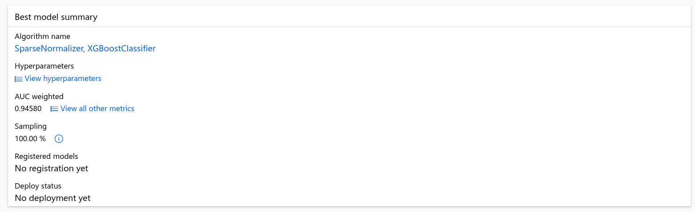
3. Deploy the best model
  
 
  In this step, we deploy the model. This will allow us to interact with it as a REST API sending POST requests.
    
 

4. Enable logging

 
  Now that the Best Model is deployed, I enabled Application Insights, so I can monitor and retrieve logs about the endpoints.
    
 

 
Application insights enabled

 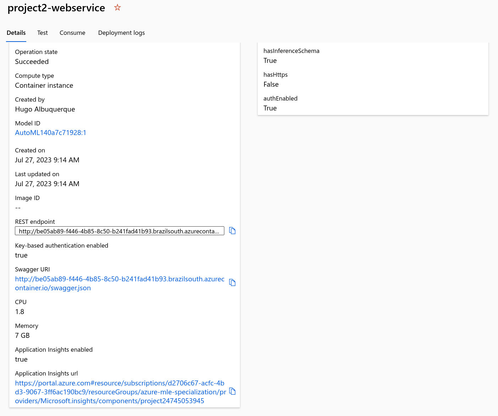
 
Logs after running logs.py

 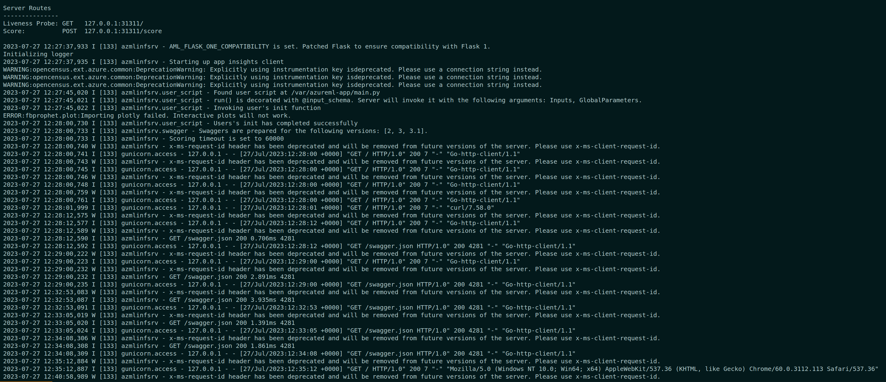
5. Swagger Documentation

 
  In this step, you will consume the deployed model using Swagger.
    
 

 
Setting up swagger locally

 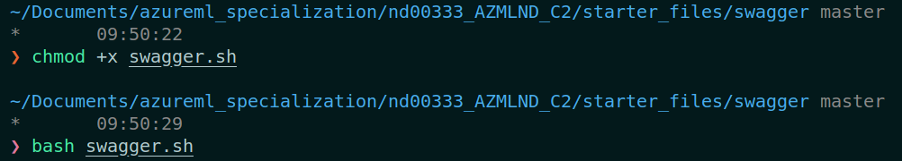
 
Running serve.py to enable CORS

 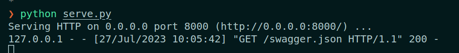
 
Using swagger api to submit a request

 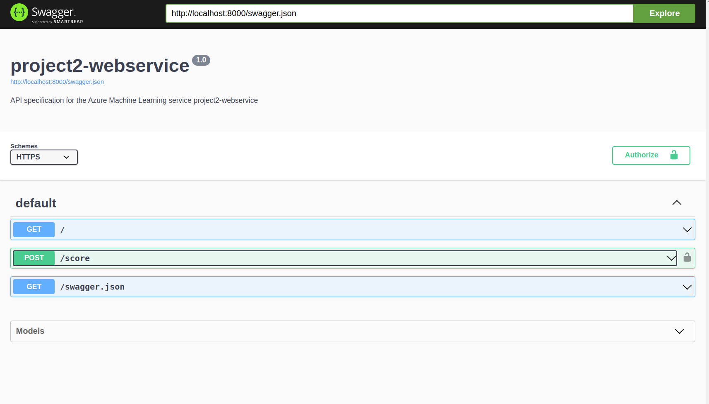
 
Score endpoint

 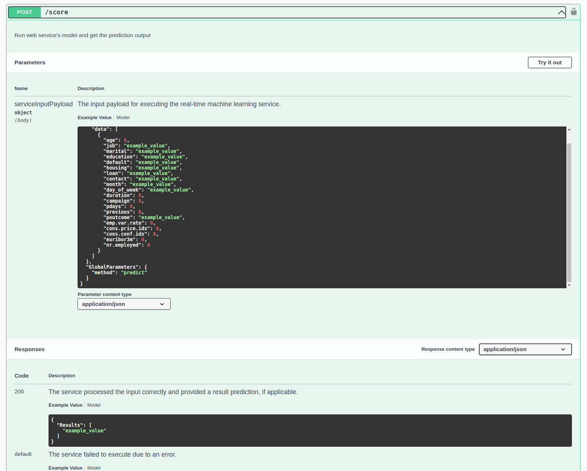
6. consume model endpoints

 
  In this step, I ran the endpoints.py script after modifying the "scoring_uri" and "key" variables to match the values generated after
deploying the model.
    
 

 
Running endpoints.py

 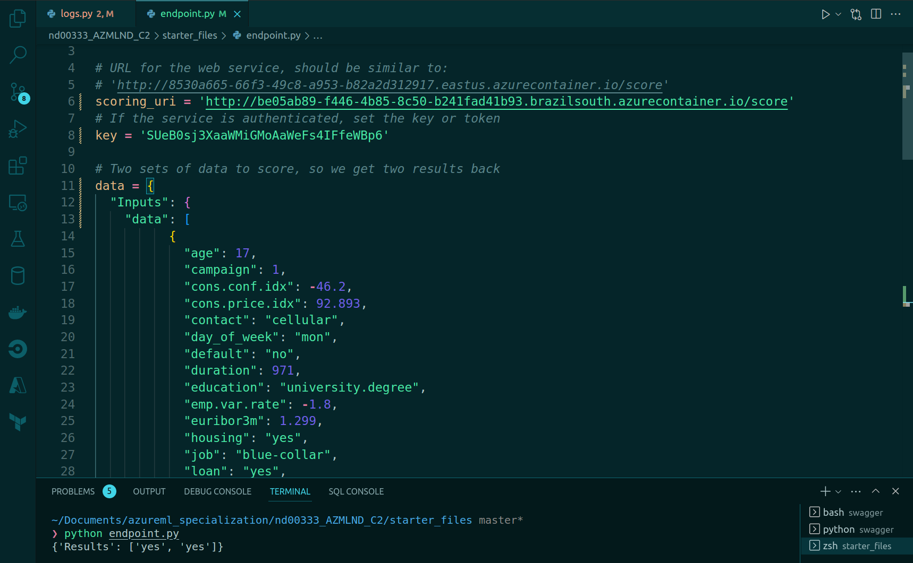
  
Benchmarking endpoint

 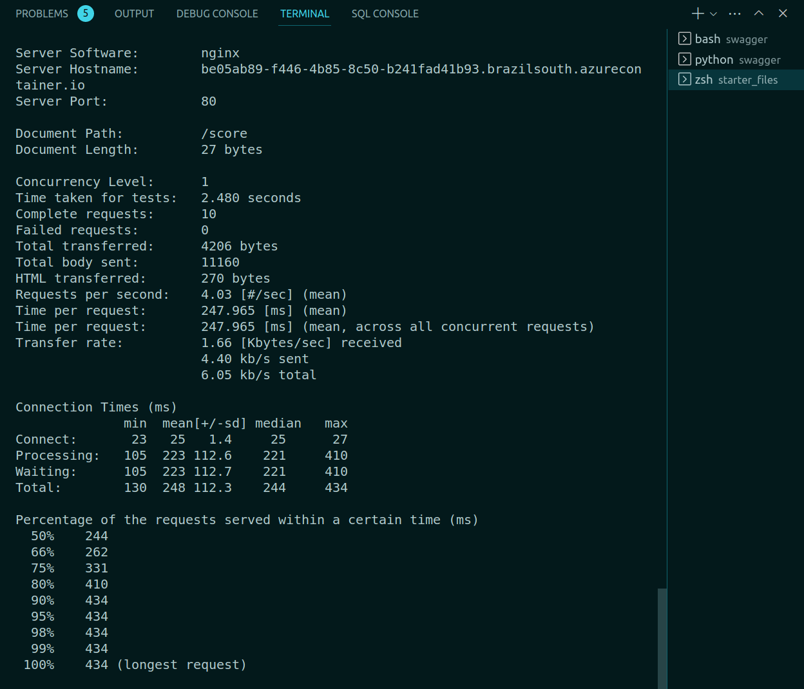

8. Create and publish a pipeline
  
 
  In this part of the project, I used the jupyter notebook provided in the starter_files folder to create, publish and consume a pipeline. The pipeline will consume the bank marketing dataset, and run an automl experiment, just like the one done previously in this project, but now using the sdk. You can check the completed notebook in this repo.
    
 

Pipeline created and Active

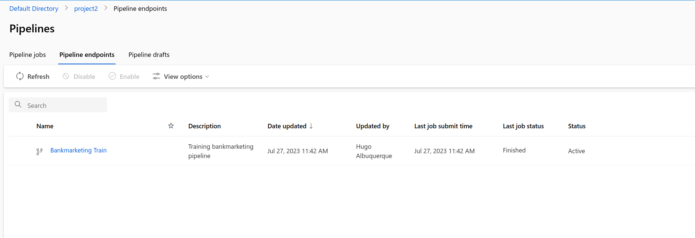

Pipeline endpoint active

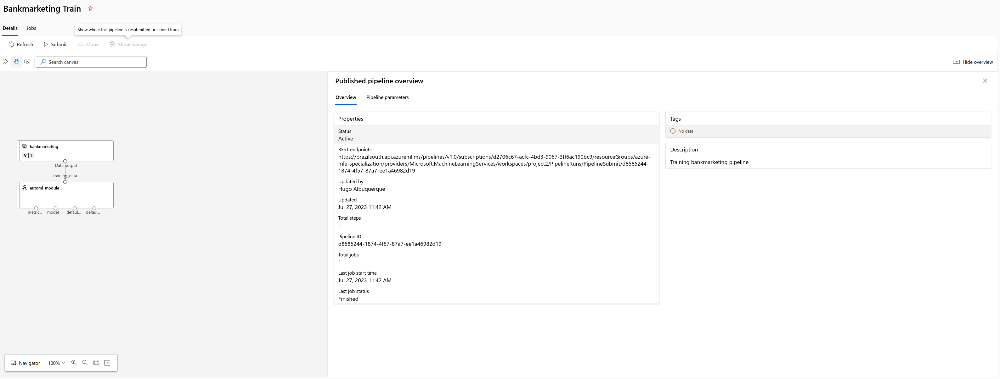

bankmarketing dataset being consumed by the pipeline

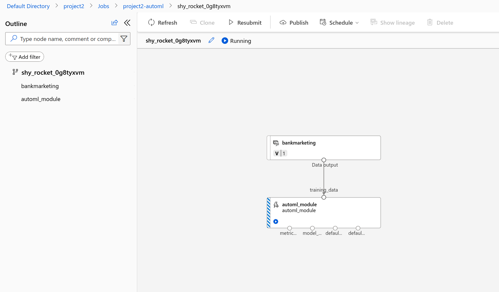

Monitoring the pipeline in the notebook with the runDetails widget

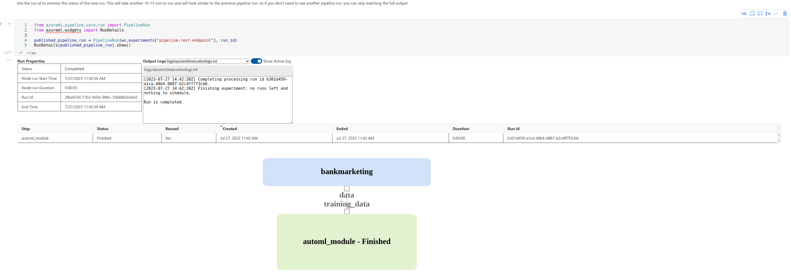

Schedule run job completed

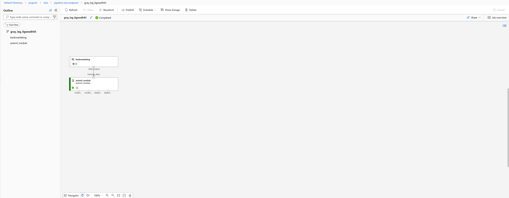

9. writing this documentation - CHECK

# Future improvements
All the work done in the project used version 1 of azureml Python SDK, but Python SDK version 2 is already available. A good experiment would be to repeat the steps outlined above using the newest version of the API and document the differences.
# screenshots along the way
# link to screencast video
